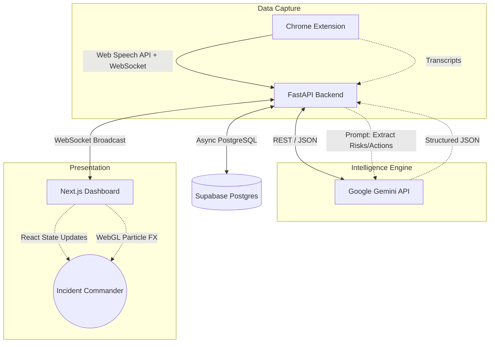

# 🌌 Sutradhar: AI-Powered Incident Response Copilot

**Sutradhar** (meaning "Director" or "String-puller" in Sanskrit) is a next-generation, AI-driven Incident Response (IR) war room platform. It acts as an autonomous copilot during critical engineering outages. 

By seamlessly listening into team communication channels, Sutradhar's AI analyzes chaotic chatter in real-time, extracts concrete facts, identifies team conflicts, automatically assigns action items, and visually orchestrates the response on a cinematic "Cybernetic Command Center" dashboard.

---

## ⚡ Core Features

- **🧠 Autonomous Intelligence Extraction:** Uses Google Gemini (3.6-Flash) to instantly parse chaotic conversations and extract structured data: `Facts`, `Hypotheses`, `Conflicts`, `Risks`, and `Action Items`.
- **🎙️ Ubiquitous Voice Capture:** A companion Chrome Extension silently captures incident audio across any platform (Google Meet, Zoom Web, Discord) and streams transcripts to the backend.
- **✨ 3D Particle FX Engine:** Voice transcripts are visually rendered in the Command Center using a custom WebGL/Canvas particle physics engine, dynamically assembling text out of glowing data points.
- **☁️ Cloud-Native State Management:** Fully backed by a serverless Supabase PostgreSQL database, persisting all incident data in real-time.
- **🗣️ Interactive Voice AI (Sutra):** Address the AI directly ("Hey Sutra") to get instant situational summaries, risk assessments, or hypothesis evaluations.

---

## 🏗️ System Architecture

Sutradhar is built on a highly decoupled, real-time microservices architecture.



### 1. The Listener (Chrome Extension)
Located in `extension-v2/`. Injects into web-based meeting tools. Uses the browser's native `SpeechRecognition` API to continuously capture audio, tag it with the user's name, and stream it via REST/WebSockets to the backend.

### 2. The Brain (FastAPI Backend)
Located in `backend/`. A high-performance async Python server. It ingests transcripts, batches them, and triggers the `IncidentAnalyzer` (`app.ai.analyzer`). The analyzer forces the LLM to output a strict JSON schema containing updated incident state, which is then serialized and saved to Supabase. It uses WebSockets to instantly push state changes to the UI.

### 3. The Command Center (Next.js Frontend)
Located in `frontend-v2/`. A stunning, dark-themed cybernetic UI built with React, Tailwind CSS, and Framer Motion. It visualizes the JSON state pushed by the backend into distinct tactical panels (Risks, Actions, Conflicts).

---

## 📂 Directory Structure

```text
Sutradhar/
├── backend/                  # Python FastAPI Backend
│   ├── app/
│   │   ├── api/              # REST & WebSocket Endpoints (analysis, transcripts)
│   │   ├── ai/               # Gemini Prompts & LLM Orchestration
│   │   ├── db/               # SQLAlchemy Models & Database Connection
│   │   └── services/         # Core Business Logic (IncidentService)
│   ├── .env                  # Secrets (DATABASE_URL, LLM_API_KEY)
│   └── requirements.txt      # Python dependencies
│
├── frontend-v2/              # Next.js React Frontend
│   ├── src/
│   │   ├── app/              # Next.js App Router Pages (Dashboard, Room)
│   │   ├── components/       # UI Components (IntelligencePanel, ParticleOrb)
│   │   ├── hooks/            # Custom Hooks (WebSockets, Audio Analysis)
│   │   └── shaders/          # WebGL GLSL shaders for 3D effects
│   ├── tailwind.config.ts    # Custom Cybernetic Theme Tokens
│   └── .env.local            # Public Envs (NEXT_PUBLIC_BACKEND_URL)
│
└── extension-v2/             # Companion Chrome Extension
    ├── public/
    │   ├── manifest.json     # Chrome Permissions (activeTab, storage)
    │   ├── background.js     # Service Worker
    │   └── content.js        # Speech Recognition Injector
    └── src/                  # React Popup UI
```

---

## 🚀 Local Development Setup

### Prerequisites
- Node.js (v18+)
- Python (3.11+)
- A Supabase Account (PostgreSQL)
- A Google Gemini API Key

### 1. Backend Setup
```bash
cd backend
python -m venv .venv
source .venv/bin/activate  # On Windows: .venv\Scripts\activate
pip install -r requirements.txt
```
Create a `.env` file in the `backend` directory:
```env
DATABASE_URL=postgresql+asyncpg://postgres:[PASSWORD]@[SUPABASE_HOST]:5432/postgres
LLM_API_KEY=AIzaSy...
LLM_PROVIDER=gemini
CORS_ORIGINS=*
```
Start the server:
```bash
uvicorn app.main:app --reload --port 8000
```

### 2. Frontend Setup
```bash
cd frontend-v2
pnpm install
```
Create a `.env.local` file in the `frontend-v2` directory:
```env
NEXT_PUBLIC_BACKEND_URL=http://localhost:8000
```
Start the development server:
```bash
pnpm run dev --port 3002
```

### 3. Extension Setup
```bash
cd extension-v2
npm install
npm run build
```
Open Chrome, navigate to `chrome://extensions`, enable **Developer Mode**, click **Load Unpacked**, and select the `extension-v2/dist` folder.

---

## 🌐 Production Deployment

For full cloud deployment instructions, refer to the included `DEPLOYMENT_GUIDE_V2.md`. 
- **Backend:** Designed for Render.com (Web Service).
- **Frontend:** Designed for Vercel.
- **Database:** Supabase.
